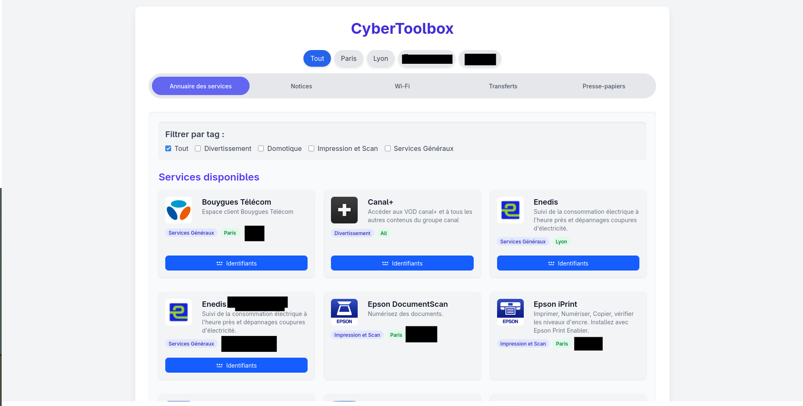

  

🛠️ CyberToolbox

Organize and share your home services with family and guests in one supercool interface.

CyberToolbox is a centralized dashboard designed for home servers. It allows you to group all your local services (Home Automation, NAS, Streaming, Security) and share them easily with your household.
You can manage multiple homes. For each home you can manage services, installation manuals of your devices and Wi-Fi QR Codes and passwords. There is also a clipboard and a transfer plateform to easily share text or files from one device to another.
🚀 Quick Start
1. Prerequisites

    A Web Server (Apache/Nginx) with PHP 8.x.

    A MySQL/MariaDB database.

    PhpMyAdmin (recommended) to manage your database tables.

2. Installation

Clone the repository into your web server's root directory:
Bash

git clone https://github.com/F-dev-git/CyberToolbox.git

3. Configuration

    Navigate to the etc/config/ directory.

    Rename config.php.example to config.php.

    Edit config.php and fill in:

        Your Database credentials (Host, User, Password, DB Name).

        Your unique Encryption Key.

🔐 Security & Encryption

To protect sensitive data within your database, CyberToolbox uses AES-256-CBC encryption. You must generate a unique key for your specific installation.

To generate your encryption key:
Open your terminal and run:
Bash

openssl rand -base64 32

Copy the generated string and paste it into the ENCRYPTION_KEY constant in your config.php file.
🏠 Usage

Once configured, access the tool via your NAS local IP address (e.g., http://192.168.1.50/CyberToolbox). From there, you can start adding services, Wi-Fi passwords...
